# Taskify UI Screenshots — Detailed Reference
---

**Admin navigation:** Dashboard · Projects · Tasks · Users · Profile  
**Staff navigation:** Dashboard · My Tasks · Profile

---

## Dashboard

### Admin — Light mode

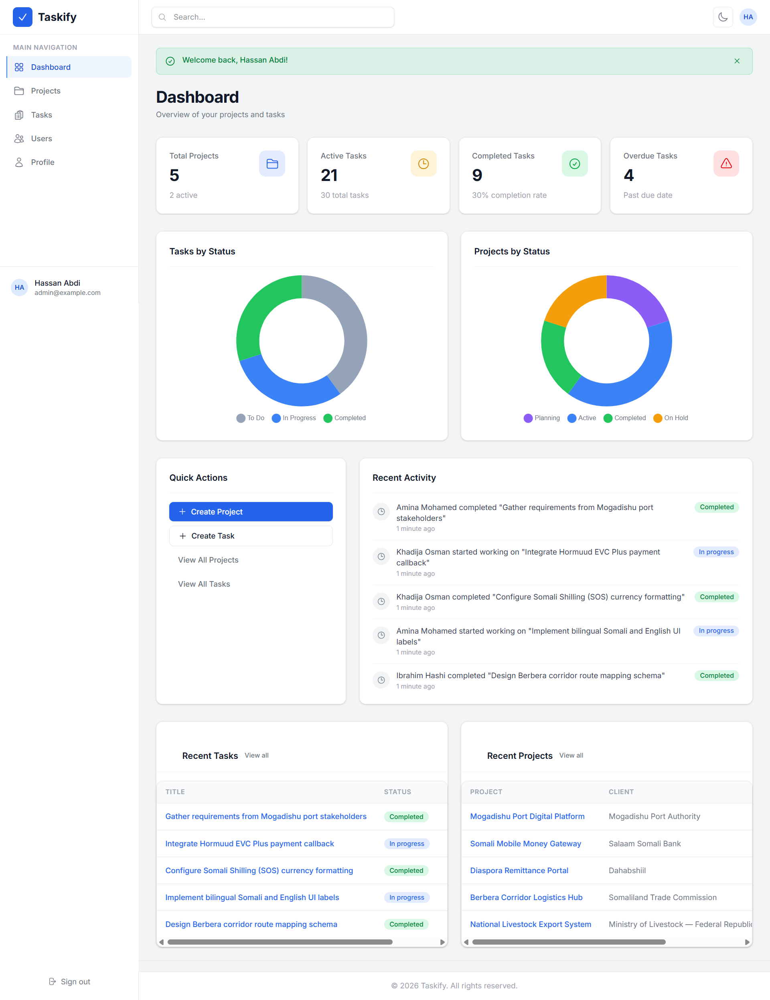

| | |
|---|---|
| **Route** | `GET /dashboard` |
| **Role** | Admin — Hassan Abdi (`admin@example.com`) |

**Page header**
- Green success banner: *"Welcome back, Hassan Abdi!"* (dismissible)
- Title: **Dashboard** — subtitle *"Overview of your projects and tasks"*

### Admin — Dark mode

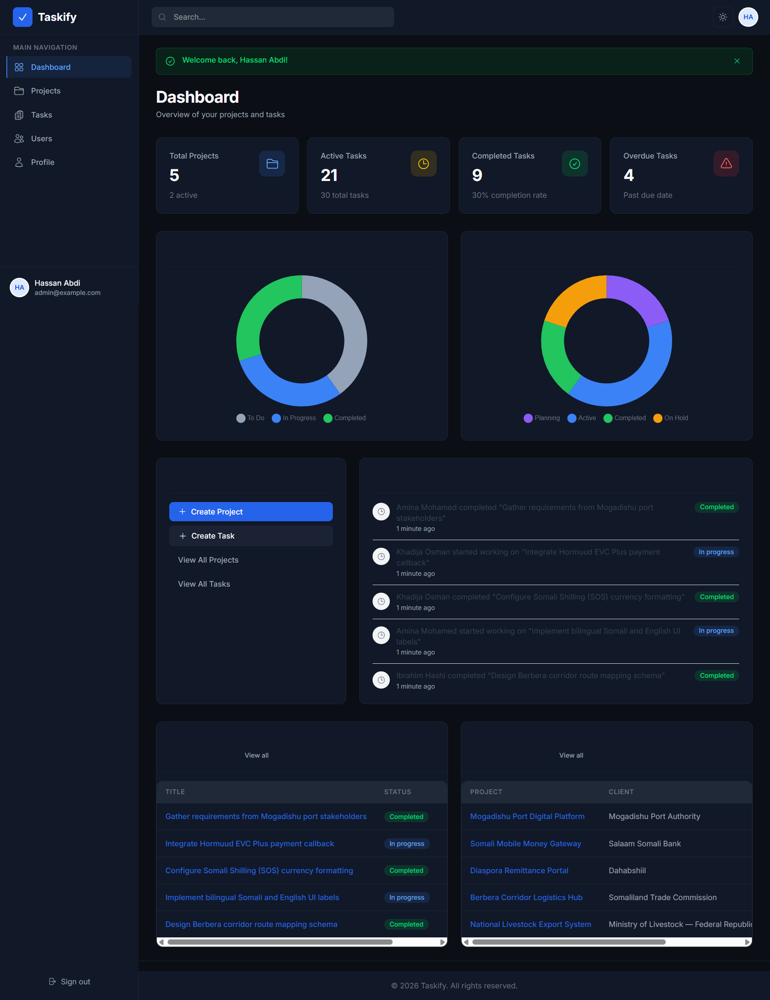

| | |
|---|---|
| **Route** | `GET /dashboard` |
| **Role** | Admin |

---

### Staff — My Dashboard

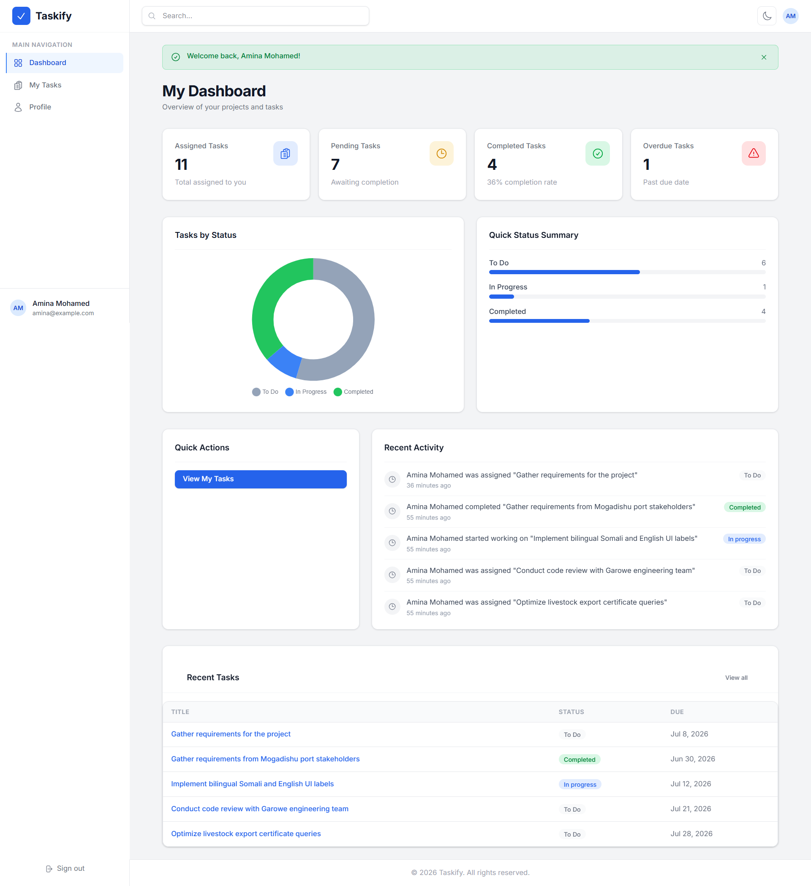

| | |
|---|---|
| **Route** | `GET /dashboard` |
| **Role** | Staff — Amina Mohamed (`amina@example.com`) |

**Sidebar** — only Dashboard, My Tasks, Profile (no Projects / Tasks / Users).

**Stat cards**

| Card | Value | Subtext |
|------|-------|---------|
| Assigned Tasks | 11 | — |
| Pending | 7 | — |
| Completed | 4 | — |
| Overdue | 1 | — |

**Charts** — personal Tasks by Status donut + Quick Status Summary horizontal bars.

**Quick Actions** — single link: View My Tasks.

**Recent Activity** — scoped to tasks assigned to Amina Mohamed only.

**Recent Tasks table** — Title, Status, Due Date with colour-coded badges.

---

## Projects (Admin only)

### Project list — Light mode

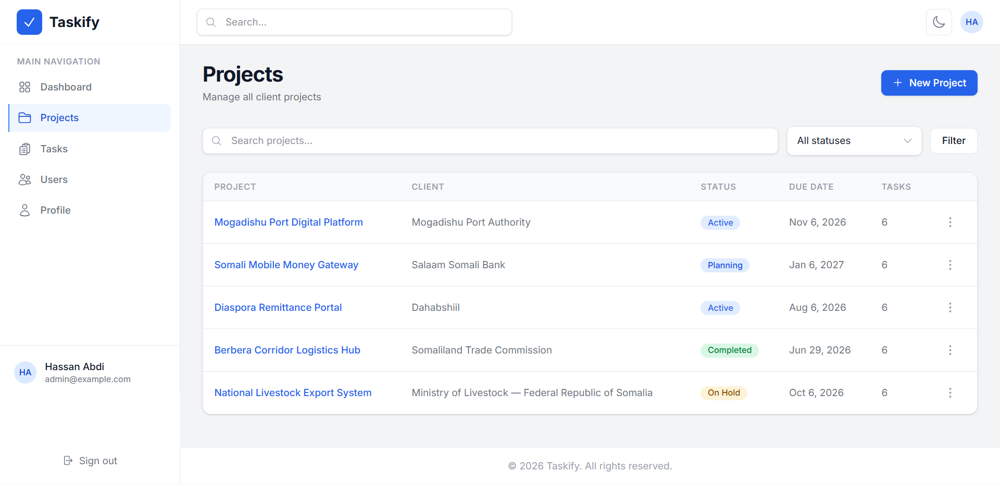

| | |
|---|---|
| **File** | `docs/screenshots/projects/view-projects/projects-lightmode.png` |
| **Route** | `GET /projects` |

**Header** — *Projects* / *Manage all projects* + **New Project** button (top right).

**Filters** — search input, status dropdown (All statuses), Filter button.

**Table columns:** Project (link) · Client · Status (badge) · Due Date · Tasks (count) · Actions (⋯ menu).

| Project | Client | Status | Tasks |
|---------|--------|--------|-------|
| Mogadishu Port Digital Platform | Mogadishu Port Authority | Active | 8 |
| Somali Mobile Money Gateway | Salaam Somali Bank | Planning | 7 |
| Diaspora Remittance Portal | Dahabshiil | Active | 6 |
| Berbera Corridor Logistics Hub | Somaliland Trade Commission | Completed | 5 |
| National Livestock Export System | Ministry of Livestock — Federal Republic of Somalia | On Hold | 3 |
| Zoobe Shop | Al Huda | Planning | 0 |

**Actions menu** — View, Edit, Delete (Delete only when `tasks_count === 0`, e.g. Zoobe Shop).

---

### Project list — Dark mode

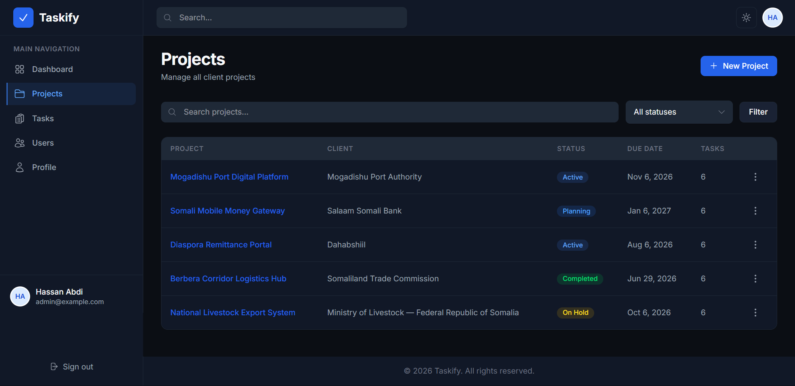

| | |
|---|---|
| **File** | `docs/screenshots/projects/view-projects/projects-darkmode.png` |
| **Route** | `GET /projects` |

Same data and columns as light mode. Dark surfaces with blue link accents. Delete unavailable for projects with tasks — menu shows *"Delete unavailable (has tasks)"*.

---

### Create project

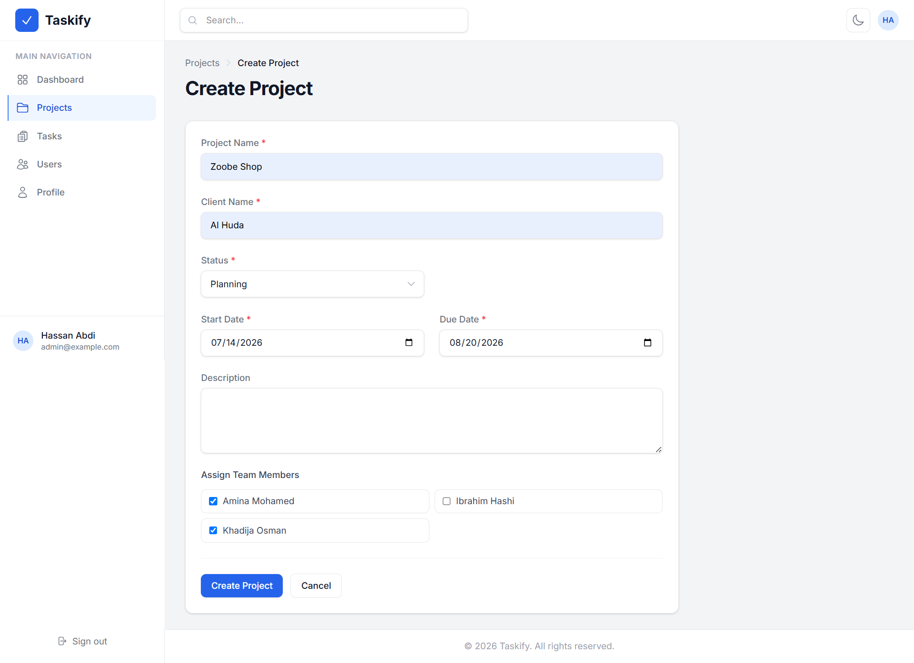

| | |
|---|---|
| **File** | `docs/screenshots/projects/new-project/create-project.png` |
| **Route** | `GET /projects/create` · `POST /projects` |

**Breadcrumb** — Projects › Create Project

**Form fields** (required marked *)

| Field | Example value |
|-------|---------------|
| Project Name * | Zoobe Shop |
| Client Name * | Al Huda |
| Status * | Planning |
| Start Date * | 07/14/2026 |
| Due Date * | 08/20/2026 |
| Description | (optional textarea) |
| Assign Team Members | ☑ Amina Mohamed · ☐ Ibrahim Hashi · ☑ Khadija Osman |

**Buttons** — Create Project (primary), Cancel.

Team checkboxes define which staff may be assigned tasks on this project.

---

### View project

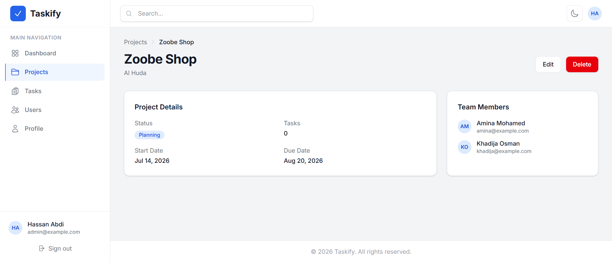

| | |
|---|---|
| **File** | `docs/screenshots/projects/view-project/view-project.png` |
| **Route** | `GET /projects/{id}` |

**Example:** Zoobe Shop — Planning · 0 tasks · Al Huda client · dates shown.

**Actions** — Edit, **Delete** (enabled because zero tasks).

**Sections**
- Project details card (status, dates, description)
- Team members list (Amina Mohamed, Khadija Osman)
- Embedded tasks table (empty for this project)

---

## Tasks

### Admin task list

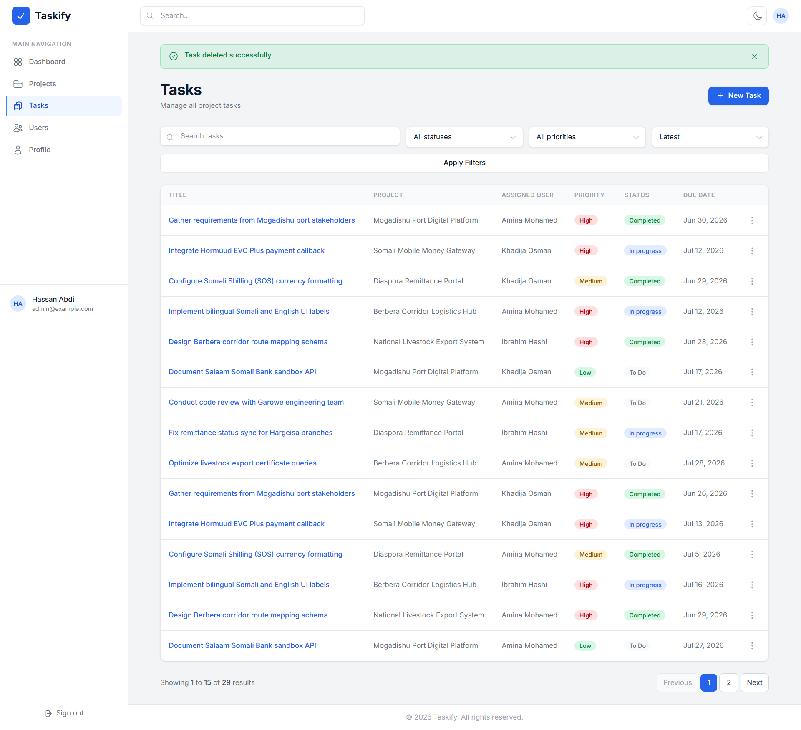

| | |
|---|---|
| **File** | `docs/screenshots/tasks/admin/tasks.png` |
| **Route** | `GET /tasks` |

**Header** — *Tasks* / *Manage all tasks* + **New Task** button.

**Filters** — search, Status, Priority, Sort (e.g. Due Date), Filter button.

**Table** — paginated (29 tasks). Columns: Title (link) · Project · Assigned User · Priority (badge) · Status (badge) · Due Date · View/Edit actions.

Sample titles: *Gather requirements from Mogadishu port stakeholders*, *Integrate Hormuud EVC Plus payment callback*, *Configure Somali Shilling (SOS) currency formatting*, *Set up Berbera corridor shipment tracking API*.

---

### Create task

| | |
|---|---|
| **File** | `docs/screenshots/tasks/admin/create task.png` |
| **Route** | `GET /tasks/create` · `POST /tasks` |

---

### Edit task

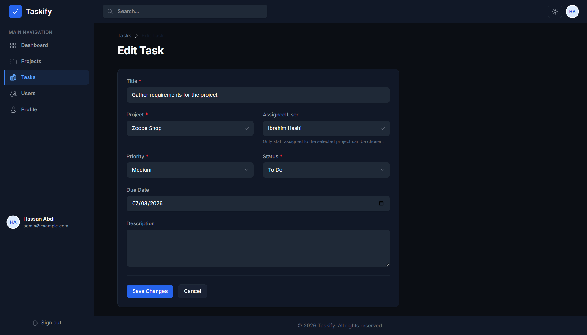

| | |
|---|---|
| **File** | `docs/screenshots/tasks/admin/edit-task.png` |
| **Route** | `GET /tasks/{id}/edit` · `PUT /tasks/{id}` |

Same layout as Create Task with fields pre-filled. Changing project refreshes the assignee list to that project's team members.

---

### View task (Admin)

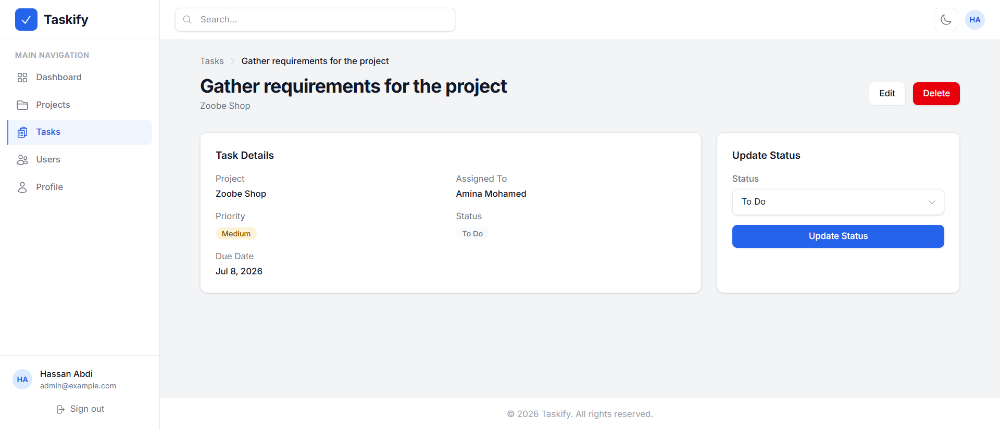

| | |
|---|---|
| **File** | `docs/screenshots/tasks/admin/view-task.png` |
| **Route** | `GET /tasks/{id}` |

**Left** — task metadata (title, project link, assignee, priority, status, due date, description).

**Right** — **Update Status** panel (dropdown + save).

**Header actions** — Edit, Delete.

---

### My Tasks (Staff)

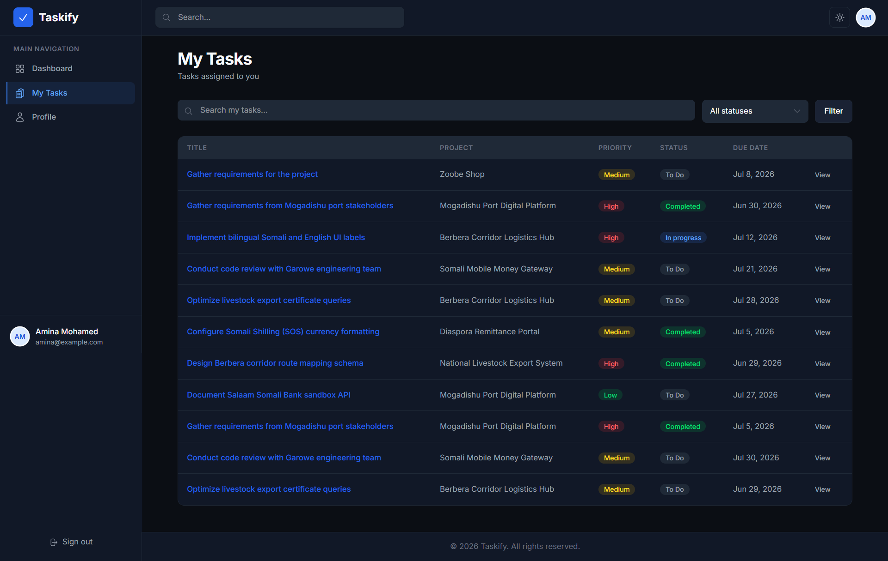

| | |
|---|---|
| **File** | `docs/screenshots/tasks/staff/view-tasks.png` |
| **Route** | `GET /my-tasks` |
| **Role** | Staff — Amina Mohamed (dark theme) |

**Header** — *My Tasks* / *Tasks assigned to you*

**Filters** — search (*Search my tasks…*), status dropdown (All statuses), Filter.

**Table columns:** Title (link) · Project · Priority · Status · Due Date · View.

Only tasks where `assigned_to` matches the signed-in user. Examples: *Implement bilingual Somali and English UI labels* (Zoobe Shop), *Configure Somali Shilling (SOS) currency formatting* (Mogadishu Port).

---

### View task (Staff)

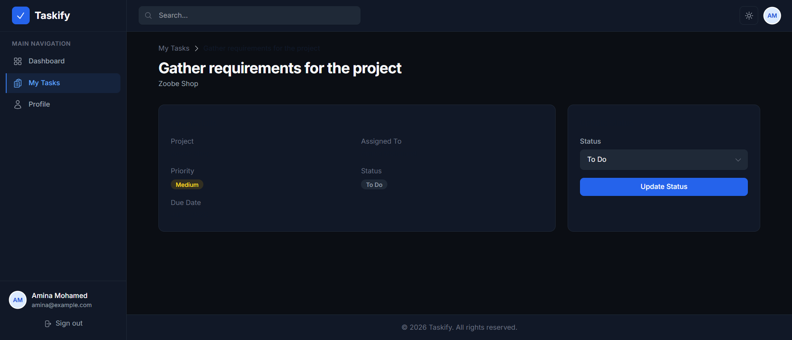

| | |
|---|---|
| **File** | `docs/screenshots/tasks/staff/view-task.png` |
| **Route** | `GET /tasks/{id}` |
| **Role** | Staff |

Read-only task details. Staff may **Update Status** only — no Edit or Delete buttons.

---

## Users (Admin only)

### User management grid

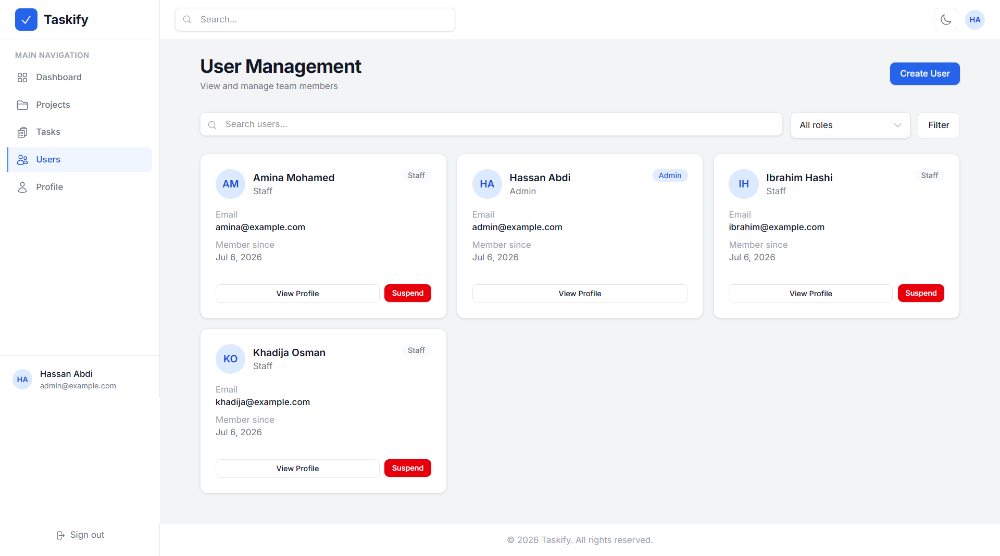

| | |
|---|---|
| **File** | `docs/screenshots/users/view-users.png` |
| **Route** | `GET /users` |

**Header** — *User Management* / *View and manage team members* + **Create User** button.

**Filters** — search (*Search users…*), role dropdown (All roles), Filter.

---

### Individual user profile

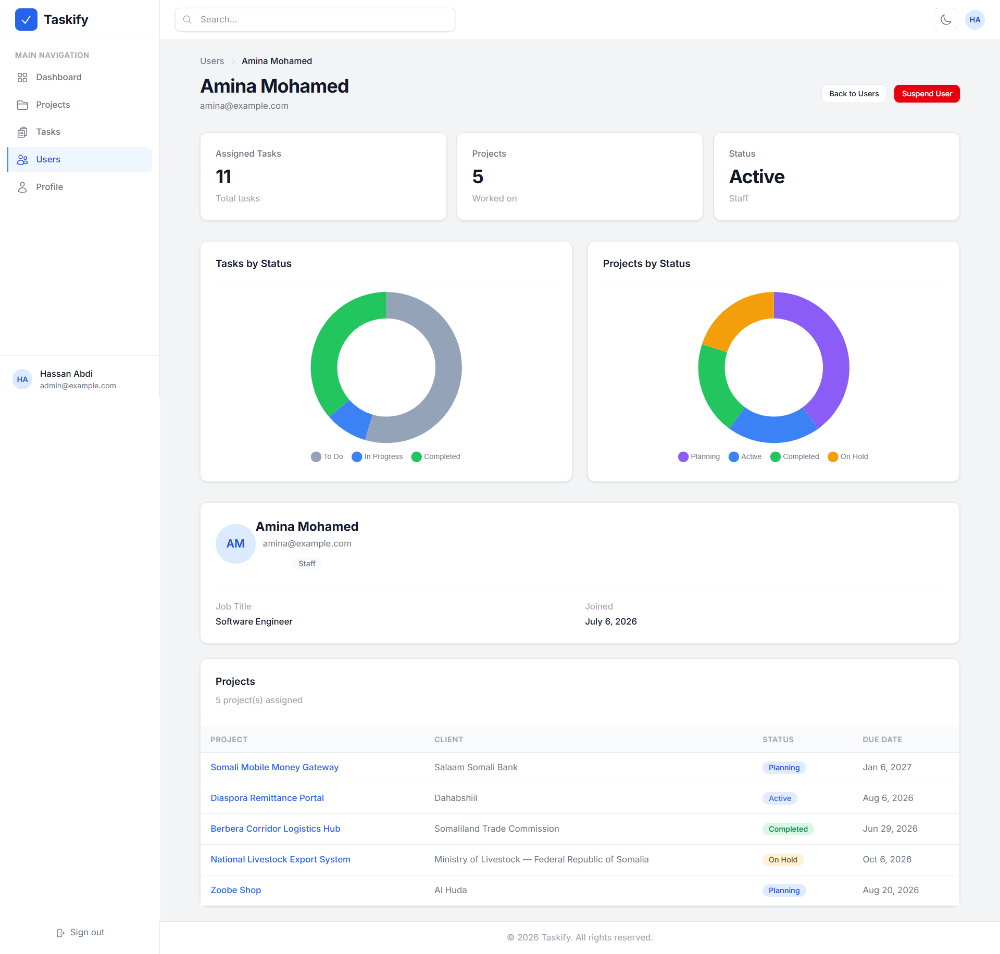

| | |
|---|---|
| **Route** | `GET /users/{id}` |
| **Example** | Amina Mohamed (`amina@example.com`) |